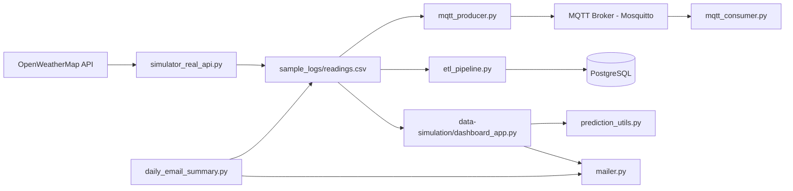

# Real-Time IoT Weather Data Engineering Pipeline

## 1. Project Summary
This project is a real-time weather data engineering pipeline that ingests live weather readings for multiple cities, streams events through MQTT, transforms data with ETL rules, stores processed data in PostgreSQL, and visualizes insights in a Streamlit dashboard.

## 2. Problem It Solves
Most weather demos stop at collecting API data. This project solves the full engineering workflow problem:
- Continuous ingestion from an external API
- Real-time message transport (producer/consumer)
- Data transformation and anomaly flagging
- Structured storage for downstream analytics
- User-facing monitoring dashboard and email notifications

## 3. My Role In The Project
Primary contributor responsibilities:
- Designed end-to-end pipeline architecture
- Implemented ingestion, MQTT streaming, ETL, dashboard, and email modules
- Containerized core services (PostgreSQL + Mosquitto)
- Added lightweight prediction logic for next-day trends
- Organized repository structure for reproducibility and portfolio presentation

## 4. Tools And Technologies
- Python
- Pandas, NumPy
- Streamlit
- MQTT (Paho MQTT)
- PostgreSQL + SQLAlchemy
- Docker and Docker Compose
- OpenWeatherMap API
- watchdog (file change listener)
- python-dotenv

## 5. Architecture


## 6. Project Structure
```text
data-egineering/
|- data-simulation/
|  |- simulator_real_api.py
|  |- dashboard_app.py
|- docker/
|  |- docker-compose.yml
|  |- mosquitto.conf
|- sample_logs/
|  |- readings.csv
|- screenshots/
|  |- dashboard-home.png
|  |- comparison-section.png
|  |- prediction-panel.png
|  |- email-feature.png
|  |- docker-containers.png
|  |- database-table.png
|- docs/
|  |- project-document.pdf
|  |- research-paper.pdf
|- etl_pipeline.py
|- mqtt_producer.py
|- mqtt_consumer.py
|- prediction_utils.py
|- mailer.py
|- daily_email_summary.py
|- test_email.py
|- requirements.txt
|- .env.example
|- .gitignore
`- README.md
```

## 7. How To Run
### Prerequisites
- Python 3.10+
- Docker Desktop
- OpenWeatherMap API key

### Setup
```bash
pip install -r requirements.txt
copy .env.example .env
```

Update `.env` with your real values.

### Start infrastructure
```bash
docker compose -f docker/docker-compose.yml up -d
```

### Run data ingestion
```bash
python data-simulation/simulator_real_api.py
```

### Run MQTT producer (terminal 2)
```bash
python mqtt_producer.py
```

### Run MQTT consumer (terminal 3)
```bash
python mqtt_consumer.py
```

### Run ETL to PostgreSQL
```bash
python etl_pipeline.py
```

### Run dashboard
```bash
streamlit run data-simulation/dashboard_app.py
```

### Optional: send summary emails
```bash
python daily_email_summary.py
```

## 8. Main Features
- Multi-city real-time weather ingestion
- CSV event stream to MQTT topic (`weather/readings`)
- Real-time alert consumer for threshold conditions
- ETL anomaly flags and human-readable advisory messages
- PostgreSQL storage for transformed weather records
- Live dashboard with:
  - city filter
  - city comparison
  - rolling trends
  - tomorrow prediction (trend-based)
  - email subscription
- Daily email summary service

## 9. Screenshots
Replace placeholder files in `screenshots/` with real captures from your local run.


## 10. Team Contribution
Use this section to show individual ownership clearly in team evaluation.

| Member | Role | Contribution |
|---|---|---|
| Ahmed (You) | Data Engineer | Pipeline design, ingestion, MQTT flow, ETL, dashboard integration |
| Team Member 2 | Data Analyst/Engineer | Add exact tasks |
| Team Member 3 | Backend/DevOps | Add exact tasks |

## 11. Future Improvements
- Replace CSV intermediate layer with Kafka and schema registry
- Add Airflow scheduling for ETL and summary jobs
- Add unit/integration tests and CI pipeline
- Improve prediction model using time-series forecasting (ARIMA/Prophet/LSTM)
- Add authentication and role-based access for dashboard users
- Add data quality checks and retry/dead-letter handling for stream failures

## 12. Documents
- [Project Document](docs/project-document.pdf)
- [Research Paper](docs/research-paper.pdf)
